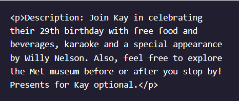
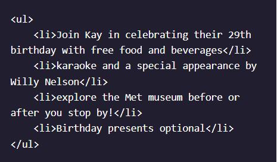
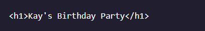
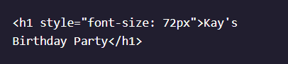

1. From the terminal, list the Git branches.
    > $ git branch  
    > $ output:  **master***   mona   whitney

2. Kay wasn't sure where she wanted to host the party, so you made several Git branches to explore different locations.

   Some of the branches are no longer needed. Delete the following branches: moma, whitney

    > $ git branch -d moma whitney  
            
    - error: The branch 'moma' is not fully merged. If you are sure you want to delete it, run 'git branch -D moma'.
    - error: The branch 'whitney' is not fully merged. If you are sure you want to delete it, run 'git branch -D whitney'.   
    
    > $ git branch -D moma whitney

3. Kay wants to see a version of the webpage that includes an unordered list with bullet points instead of a paragraph to show information about the party.

   Create a new branch called unordered-list and switch over to it.
   
    > $ git checkout -b unordered-list

4. In **index.html**, replace:
   
      
   
    with this unordered list  
    
      
    
    > $ vim index.html   update the change as per above images

5. Add **index.html** to the staging area.
    
    > $ git add index.html

6. Now make a commit.

    > $ git commit -m "modified the p-tag with unordered list"

7. Kay approves the changes you made in the **unordered-list** branch. 
   Switch over to **master**. Then, merge **unordered-list** into **master**. This will be a *fast forward merge*.
   
   > $ git checkout master
   > $ git merge unordered-list

8. Kay wants the heading to be way bigger. Create a new branch called **big-heading**.
    
    > $ git branch big-heading

9. Now, switch over the big-heading branch.  
   To make the heading bigger, replace the line below:
   
     
   
   with this line:
   
     
   
    > $ git checkout big-heaading
    > $ vim index.html

10. Add **index.html** to the staging area.
    
    > $ git add index.html

11. Make a commit
    
    > $ git commit -m "updated the h1 header tag"

12. Kay approves of the giant heading!
    Switch back over to the **master** branch. Then, merge **big-heading** into **master**.
    
    > $ git checkout master
    > $ git merge big-heading
